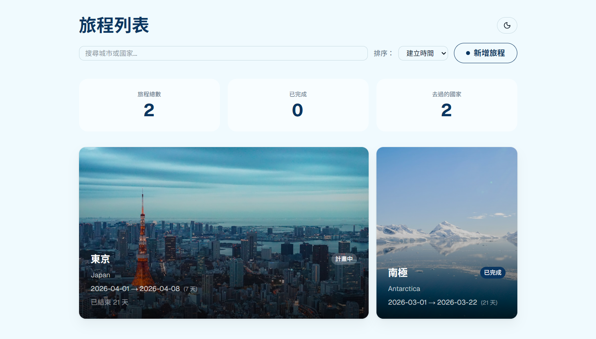
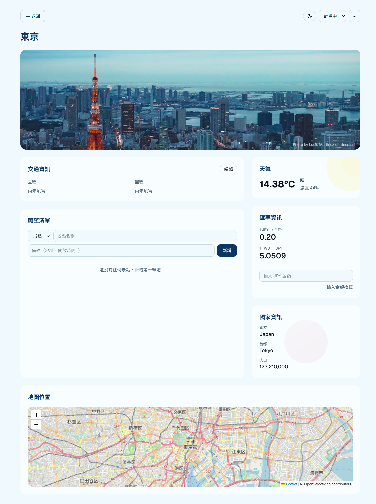
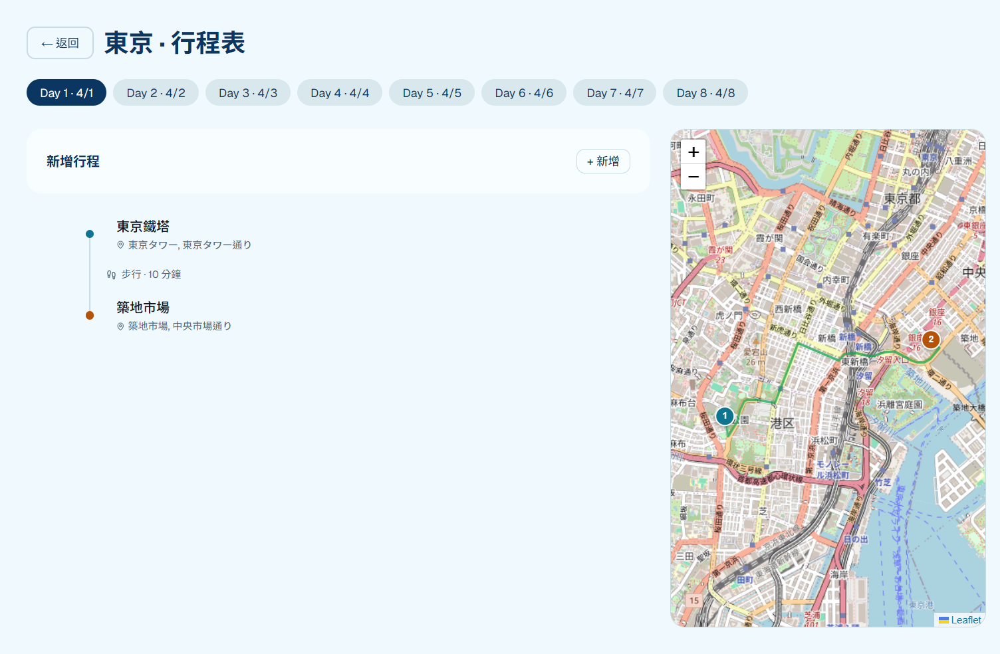
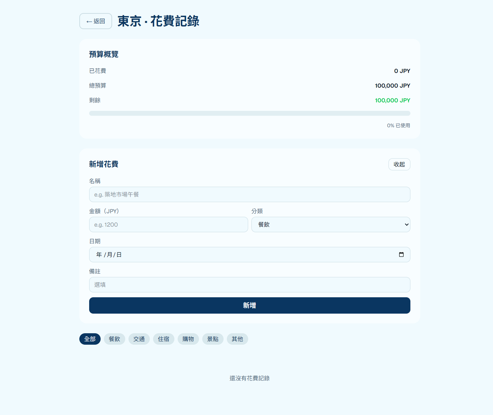
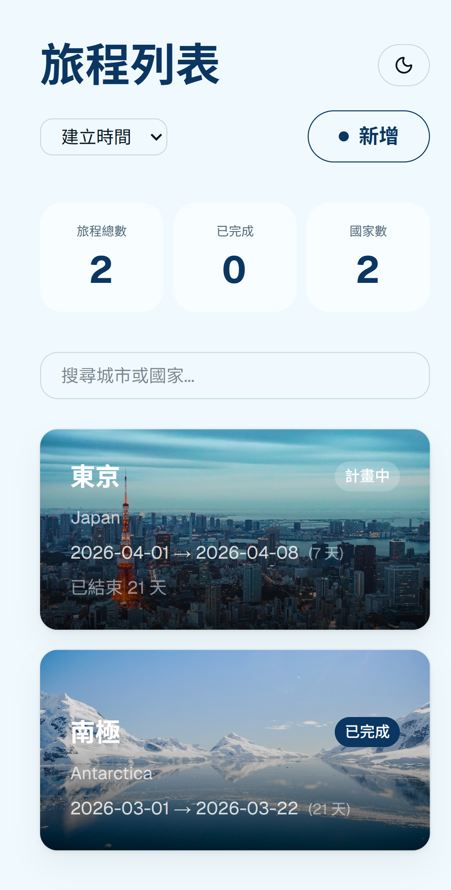

# Travel App

A full-stack travel planning web application built with React and Node.js.

**[Live Demo](https://travel-app-pi-liart.vercel.app/)** · [Backend Repo](https://github.com/gagaa03/travel-app-server) · [繁體中文](README.zh-TW.md)

---

## Features

- **Trip Management** — Create, edit, and delete trips with status tracking (Planning / In Progress / Completed)
- **Trip Detail** — Real-time weather, country info, currency exchange rate, and city photos via external APIs
- **Itinerary Planner** — Day-by-day schedule with drag-and-drop reordering, categories, and location search
- **Interactive Map** — Route visualization with colors by transport method (walk, transit, car, flight)
- **Reservations** — Track hotel, restaurant, and attraction bookings
- **Expense Tracker** — Log spending, set budgets, and view progress
- **Search & Filter** — Filter trips by status, sort by date or city
- **Dark Mode** — System-wide dark/light theme toggle
- **Responsive Design** — Optimized for both mobile and desktop

## Tech Stack

**Frontend**
- React 18 + Vite
- Tailwind CSS
- shadcn/ui + Framer Motion
- React Router v6
- React Leaflet (OpenStreetMap + OSRM routing)
- dnd-kit (drag and drop)

**Backend**
- Node.js + Express
- PostgreSQL (Supabase)
- REST API

**Deployment**
- Frontend: Vercel
- Backend: Render
- Database: Supabase

## APIs Used

| API | Purpose |
|-----|---------|
| OpenWeatherMap | Current weather by city |
| REST Countries | Country info and flag |
| ExchangeRate API | Live currency exchange |
| Unsplash | City cover photos |
| Nominatim (OpenStreetMap) | Location search & geocoding |
| OSRM | Real walking/driving routes |

## Getting Started

### Prerequisites
- Node.js 18+
- PostgreSQL database

### Frontend

```bash
git clone https://github.com/gagaa03/travel-app.git
cd travel-app
npm install
```

Create a `.env` file:

```env
VITE_API_URL=http://localhost:3000
VITE_WEATHER_API_KEY=your_key
VITE_UNSPLASH_API_KEY=your_key
VITE_EXCHANGE_API_KEY=your_key
```

```bash
npm run dev
```

### Backend

```bash
git clone https://github.com/gagaa03/travel-app-server.git
cd travel-app-server
npm install
```

Create a `.env` file:

```env
DB_HOST=your_host
DB_PORT=5432
DB_USER=your_user
DB_PASSWORD=your_password
DB_NAME=postgres
PORT=3000
```

```bash
npm start
```

## Screenshots











## License

MIT
