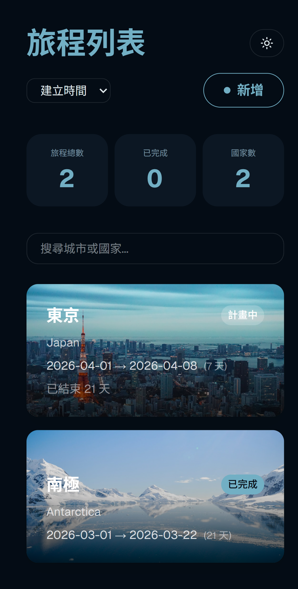

# Travel App 旅遊規劃應用

全端旅遊規劃網頁應用程式 — 管理旅程、規劃行程、追蹤花費，並透過即時資料探索目的地。

**[線上 Demo](https://travel-app-pi-liart.vercel.app/)** · [後端 Repo](https://github.com/gagaa03/travel-app-server)

---

## 截圖


<p><sub>旅程列表 — 搜尋、篩選、排序所有旅程</sub></p>


<p><sub>旅程詳情 — 即時天氣、匯率、國家資訊與城市照片</sub></p>


<p><sub>行程規劃 — 拖曳排序行程，搭配互動地圖與路線顏色</sub></p>


<p><sub>花費記錄 — 記錄支出並追蹤預算進度</sub></p>

<table>
  <tr>
    <td align="center">
      <br/>
      <sub>手機版</sub>
    </td>
    <td align="center">
      <br/>
      <sub>夜間模式</sub>
    </td>
  </tr>
</table>

---

## 功能介紹

- **旅程管理** — 新增、編輯、刪除旅程，支援狀態追蹤（計畫中 / 進行中 / 已完成）
- **旅程詳情** — 即時天氣、國家資訊、即時匯率、城市封面照片
- **行程規劃** — 逐日行程安排，支援拖曳排序、分類標籤、地點搜尋
- **互動地圖** — 路線視覺化，依交通方式顯示不同顏色（步行、大眾運輸、開車、飛機）
- **訂位記錄** — 記錄飯店、餐廳、景點訂位資訊
- **預算追蹤** — 記錄花費、設定預算、進度條顯示
- **搜尋與篩選** — 依狀態篩選旅程，依日期或城市排序
- **深色模式** — 全站深色 / 淺色主題切換
- **響應式設計** — 支援手機與桌機

---

## 技術架構

### 前端
- React 18 + Vite
- Tailwind CSS + shadcn/ui + Framer Motion
- React Router v6
- React Leaflet（OpenStreetMap + OSRM 路線）
- dnd-kit（拖曳排序）

### 後端
- Node.js + Express
- PostgreSQL（Supabase）
- REST API

### 部署
- 前端：Vercel
- 後端：Render
- 資料庫：Supabase

### 使用的 API

| API | 用途 |
|-----|------|
| OpenWeatherMap | 即時天氣資訊 |
| REST Countries | 國家資訊與旗幟 |
| ExchangeRate API | 即時匯率換算 |
| Unsplash | 城市封面照片 |
| Nominatim（OpenStreetMap） | 地點搜尋與地理編碼 |
| OSRM | 真實步行 / 駕車路線 |

---

## 本地啟動

### 前端

```bash
git clone https://github.com/gagaa03/travel-app.git
cd travel-app
npm install
```

建立 `.env` 檔案：

```env
VITE_API_URL=http://localhost:3000
VITE_WEATHER_API_KEY=your_key
VITE_UNSPLASH_API_KEY=your_key
VITE_EXCHANGE_API_KEY=your_key
```

```bash
npm run dev
```

### 後端

```bash
git clone https://github.com/gagaa03/travel-app-server.git
cd travel-app-server
npm install
```

建立 `.env` 檔案：

```env
DB_HOST=your_host
DB_PORT=5432
DB_USER=your_user
DB_PASSWORD=your_password
DB_NAME=postgres
PORT=3000
```

```bash
npm start
```

---

## 授權

MIT
